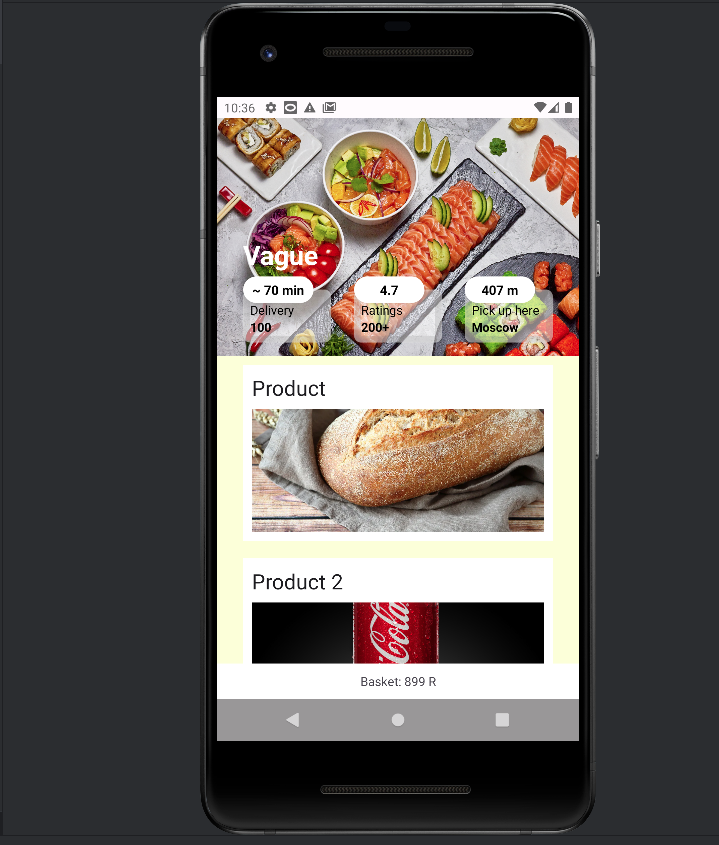

### The first app on Kotlin & Android studio

Author: @AlexZhaba, Aleksandr Zhavoronkov, 211-321

Which technology and techniques was used:
- ConstraintLayout: baselines, guidelines, controlling linear groups with a chain
- RecyclerView: custom adapter and view holder for own set of data

Screenshot:

